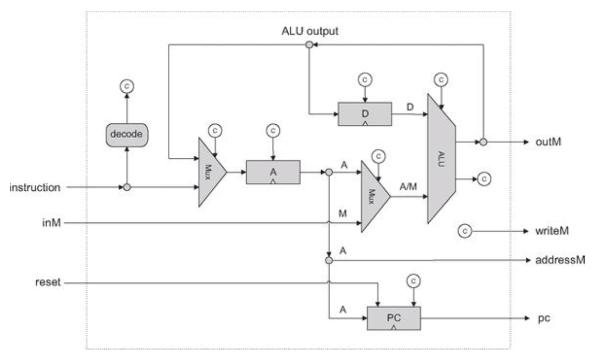

# Computer Architecture
This is project 05 of nand2tetris, in which we combine a 32K ROM, elementary CPU, and RAM (regular registers, screen and keyboard memory maps) to make (emulate) a simple computer. CPU has two registers - A and B. Instruction is 16-bit. If first bit is 0, then rest of the bits are stored in A, else rest of the bits indicate which commands to perform. If first bit is 1, the instruction looks like "111a cccccc ddd jjj" where "a" indicates whether to input A (address) or M (value at address) into the ALU. "cccccc" denote remaining parameters for ALU, "ddd" indicates destination (where to store ALU output) and "jjj" is the jump instruction. The jump instruction makes it Turing complete.

Here's the CPU diagram.

The "c" circles are control bits. The "reset" bit is external input. "outM", "writeM", "addressM", are inputs to RAM, and "pc" is the next instruction to execute (which is input to ROM, which fetches it and inputs to CPU).  
